class: center, middle

.linea-superior[]
.linea-inferior[]


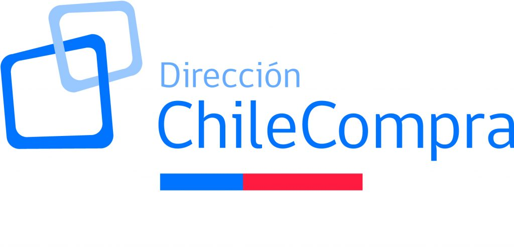


## Experiencias relevantes y aportes para el cargo

### Proceso de selección cargo Jefatura Dpto. Estudios y Políticas de Compra

#### 29 de Septiembre 2025

```{r setup, include=FALSE}
options(htmltools.dir.version = TRUE)
knitr::opts_chunk$set(message = FALSE) 
```

```{r xaringan-themer, include=FALSE, warning=FALSE}
library(xaringanthemer)
#style_duo_accent(
 # primary_color = "#1381B0",
  #secondary_color = "#FF961C",
  #inverse_header_color = "#FFFFFF"
#)
```


---

background-image: url("imagenes/fondo-cc-up.PNG")
background-size: contain;
background-position: 100% 0%

# Presentación

--

Ignacio Agloni

--

.medium-par[Sociólogo, Universidad de Chile]

--

- .medium-par[Magister(c) en Tecnologías de la Información, Universidad de Chile]


--

  Diplomado Nueva Protección de Datos Personales en Chile: U. Central

--

   Diplomado en Ingeniería de Software, U. de Chile 

--

   Diplomado en Inteligencia Artificial, U. de Chile

--

   Diplomado en Big Data para Políticas Públicas, UAI

--

- .medium-par[Jefe de Proyecto Ciencia de Datos, INE]

--

- .medium-par[Jefe de Proyecto Servicios Compartidos, INE]

--

- .medium-par[Jefe de Proyecto Piloto Casen 2022, INE con MDSF]

---

background-image: url("imagenes/fondo-cc-up.PNG")
background-size: contain;
background-position: 100% 0%

# Experiencias relevantes para el cargo

--

1. **Liderazgo en desarrollo de iniciativas de modernización tecnológica** para mejorar la **eficiencia y eficacia** en el negocio

--

.pull-left[Arquitectura y administración  de **datalake institucional**
<br/>
<br/>
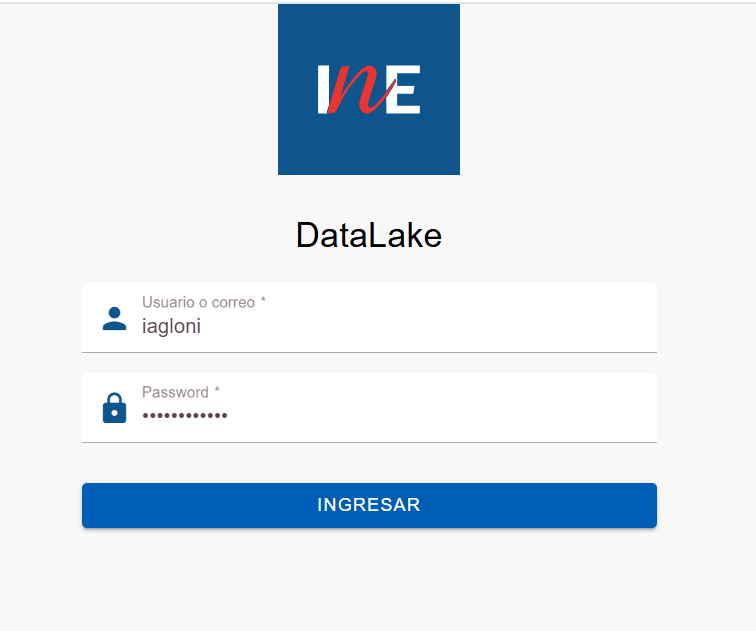]

--

.pull-rigth[<br/>
<br/>
<br/>
]


---

background-image: url("imagenes/fondo-cc-up.PNG")
background-size: contain;
background-position: 100% 0%

# Experiencias relevantes para el cargo

--

1. **Liderazgo en desarrollo de iniciativas de modernización tecnológica** para mejorar la **eficiencia y eficacia** en el negocio

--

.pull-left[Creación y mantención de API para **codificación automática** de clasificadores con *machine learning*. [Link tutorial en web INE](https://www.ine.gob.cl/calidad-estadistica/clasificaciones/api-codificacion)
<br/>
<br/>
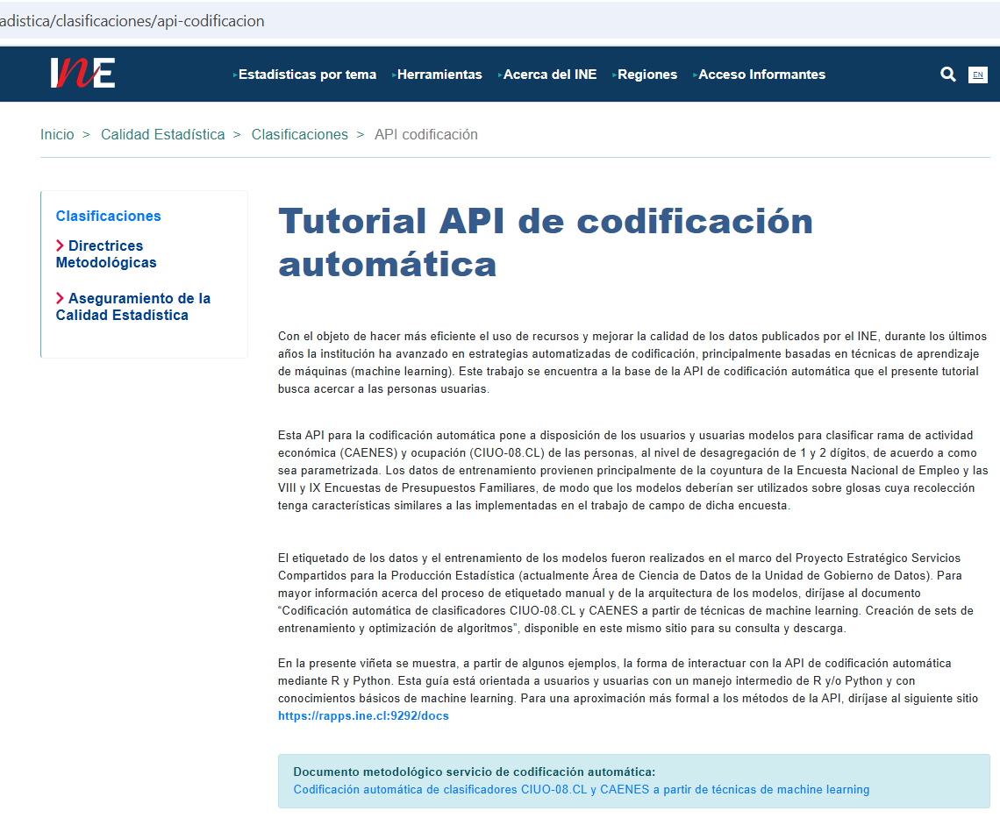]

.pull-rigth[<br/>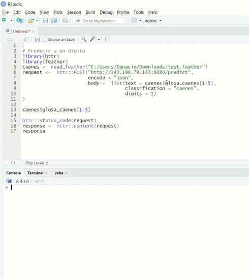]

---

background-image: url("imagenes/fondo-cc-up.PNG")
background-size: contain;
background-position: 100% 0%

# Experiencias relevantes para el cargo


1. **Liderazgo en desarrollo de iniciativas de modernización tecnológica** para mejorar la **eficiencia y eficacia** en el negocio

.pull-left[Gestión del desarrollo y mantención aplicación web **¿Dónde está el Censo?** [Link aparición en prensa](https://www.t13.cl/noticia/nacional/donde-esta-censo-revisa-donde-estan-encuestadores-tu-comuna-9-3-2024) 
<br/>
<br/>
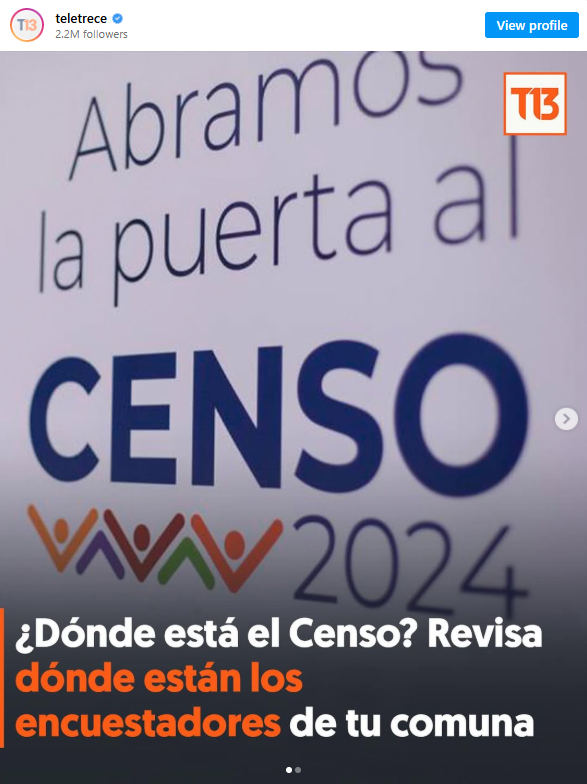]

.pull-rigth[<br/>
<br/>
<br/>
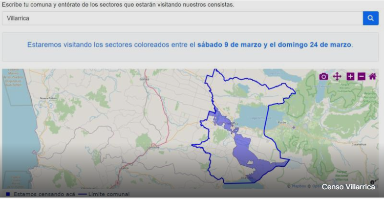
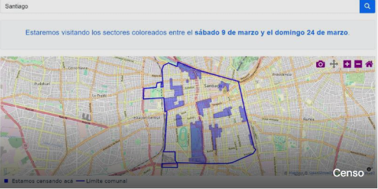]

---

background-image: url("imagenes/fondo-cc-up.PNG")
background-size: contain;
background-position: 100% 0%

# Experiencias relevantes para el cargo


1. **Liderazgo en desarrollo de iniciativas de modernización tecnológica** para mejorar la **eficiencia y eficacia** en el negocio

--

.pull-left[Diseño y mantención de **dashboards de paradatos** para el seguimiento operativo de encuestas (60 a 120 millones de registros).  
<br/>
<br/>
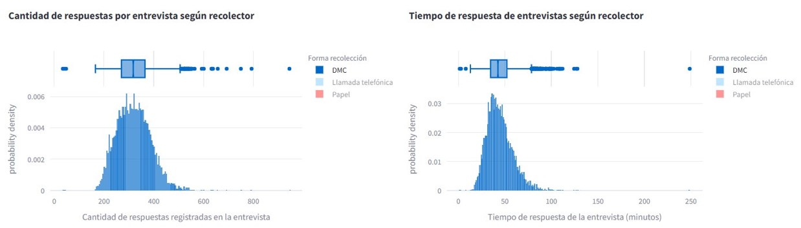]

.pull-rigth[<br/>
<br/>
<br/>
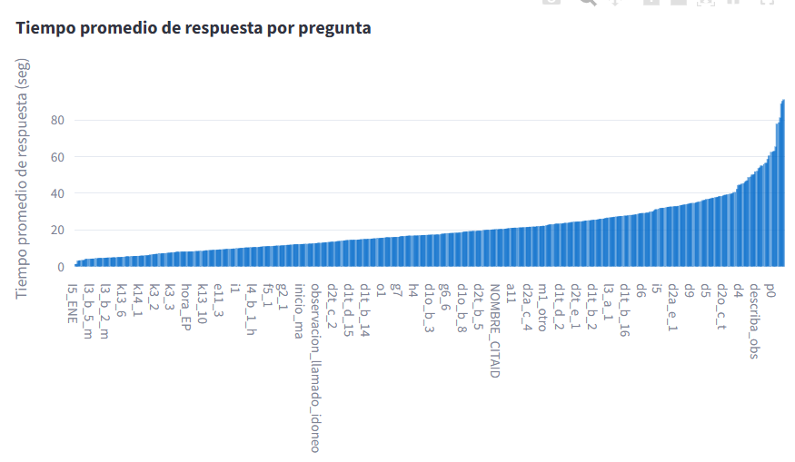]

--

**Capacitación en R y herramientas de productividad** (más de 250 funcionarios a la fecha) [repositorio R básico](https://github.com/Capacitacion-R-basico) / [repositorio R intermedio](https://github.com/clases-r-intermedio)

--

Diseño de **estándares para procesamiento de datos** en el INE

---

background-image: url("imagenes/fondo-cc-up.PNG")
background-size: contain;
background-position: 100% 0%

# Experiencias relevantes para el cargo

<ol>
  <li value="2">Desarrollo de <strong>servicios transversales</strong> para la institución</li>
</ol>

--

.pull-left[Desarrollo y mantención de **anonimizador de documentos** administrativos con inteligencia artificial.  
<br/>
<br/>
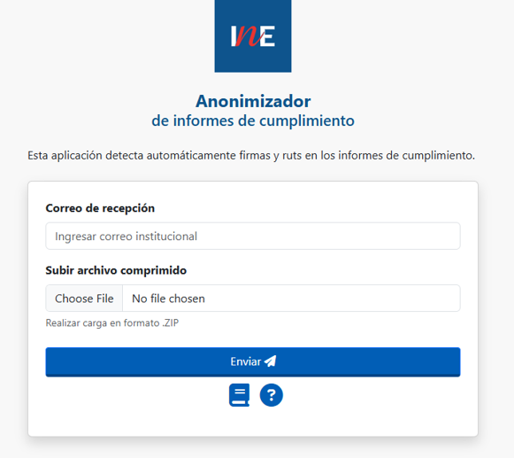]

.pull-rigth[<br/>
<br/>
<br/>
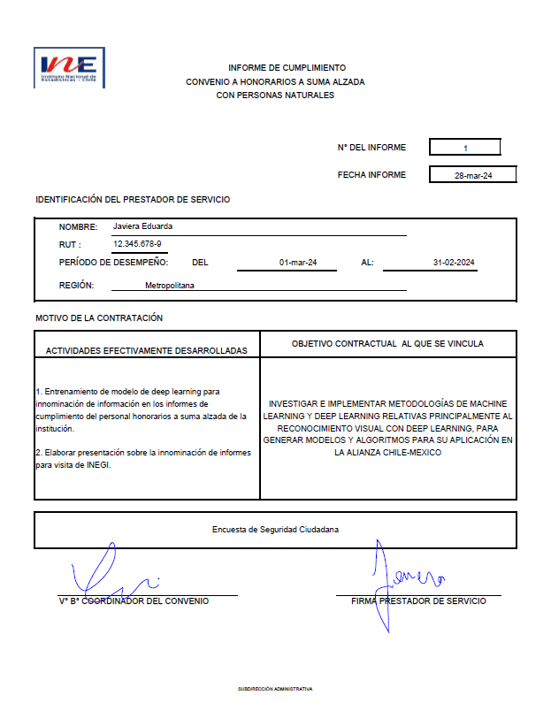
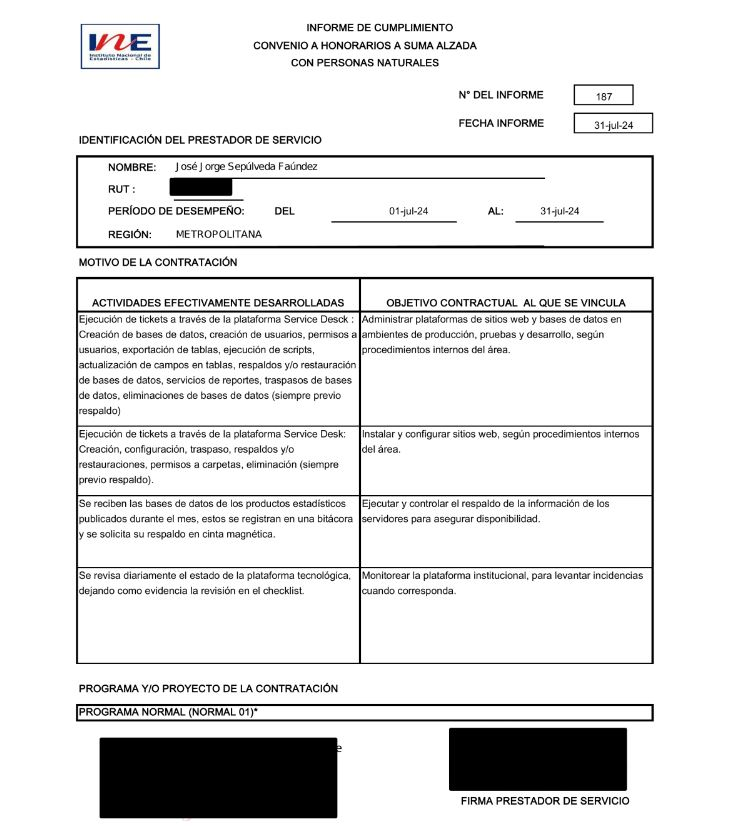]

--

<br/>

Desarrollo de **aplicación para formulación presupuestaria**

---

background-image: url("imagenes/fondo-cc-up.PNG")
background-size: contain;
background-position: 100% 0%

# Experiencias relevantes para el cargo

--

<ol>
  <li value="3"><strong>Generación de la gobernanza de datos</strong> en el INE</li>
</ol>

-Creación de **políticas, protocolos y procesos** para la gestión y uso de datos<br/>
-Diseño y administración de **datalake para la gobernanza de activos** de información<br/>
-Impulso de la **gestión del cambio** institucional en torno a la eficiencia y protección de datos

--

<ol>
  <li value="4">Experiencia en <strong>manejo de presupuestos en el Estado</strong> y como <strong>comprador público</strong></li>
</ol>

--

<ol>
  <li value="5">5 años de experiencia <strong>liderando equipos de alto desempeño técnico en el Estado</strong></li>
</ol>


---

background-image: url("imagenes/fondo-cc-up.PNG")
background-size: contain;
background-position: 100% 0%

# Aportes para el cargo

--

</br>

- Conocimiento en implementación de **pipelines de extracción, transformación y carga (ETL) automatizados** para asegurar la **calidad de los datos** en el datawrehouse institucional

--

- Conocimiento aplicado en proyectos de **ciencia de datos e inteligencia artificial**, posibles de utilizar en la realización de estudios y modelos predictivos desde el departamento

--

- Generación de la **gobernanza de datos en ChileCompra**, a partir de la experiencia obtenida en el cargo en el INE

--

- Vasta experiencia aplicable en la generación de **dashboards de indicadores** para el seguimiento del comportamiento de usuarios de las plataformas y del sistema de compras públicas en general

--

- Vasta experiencia aplicable en la generación de **visualizaciones** que sirvan a **clientes internos y externos de ChileCompra**, desde una perspectiva de probidad y transparencia

---

background-image: url("imagenes/fondo-cc-up.PNG")
background-size: contain;
background-position: 100% 0%

# Aportes para el cargo

--

</br>

- **Conocimiento en diseños de investigación**, sólidos en lo cuantitativo y suficientes en lo cualitativo

--

- Preocucupación especial por estimular un **buen clima de trabajo** en el equipo y el **desarrollo profesional continuo** de sus integrantes

---

class: center, middle

.linea-superior[]
.linea-inferior[]


## Experiencias relevantes y aportes para el cargo

### Proceso de selección cargo Jefatura Dpto. Estudios y Políticas de Compra

#### 29 de Septiembre 2025
